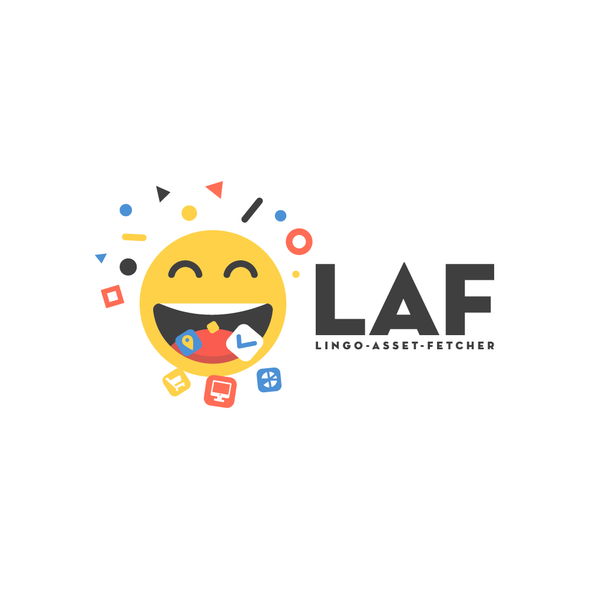
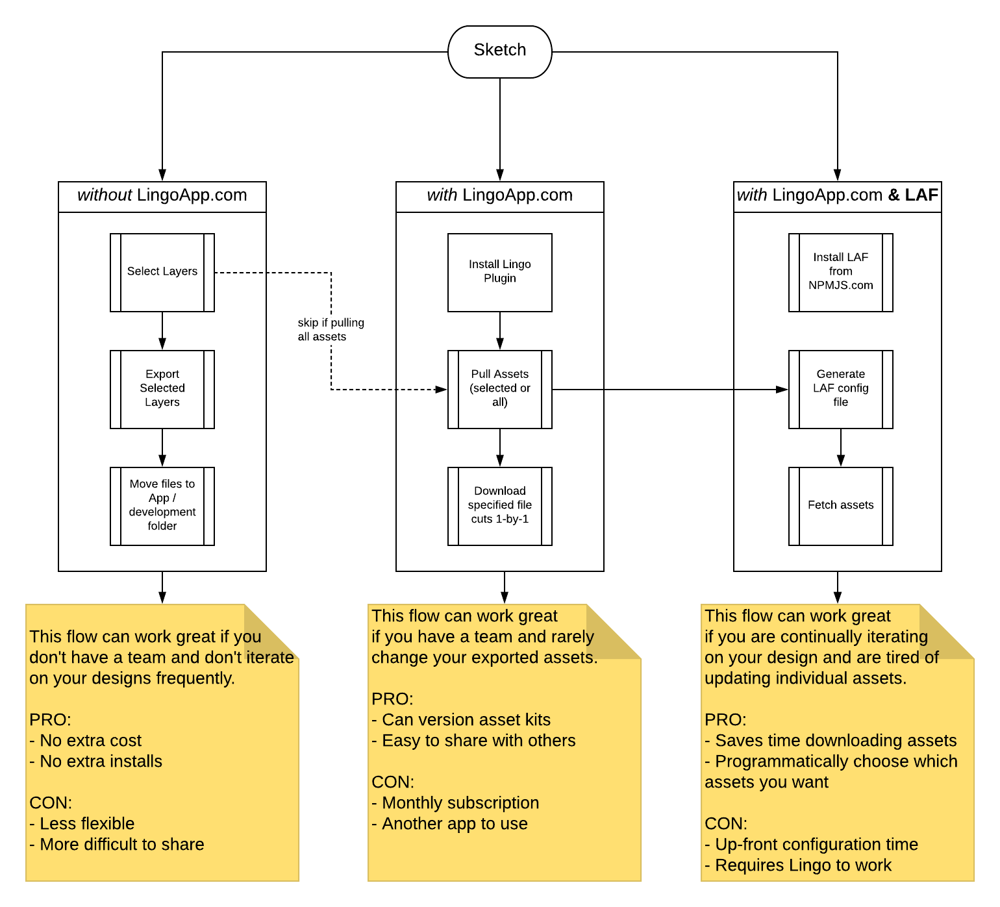
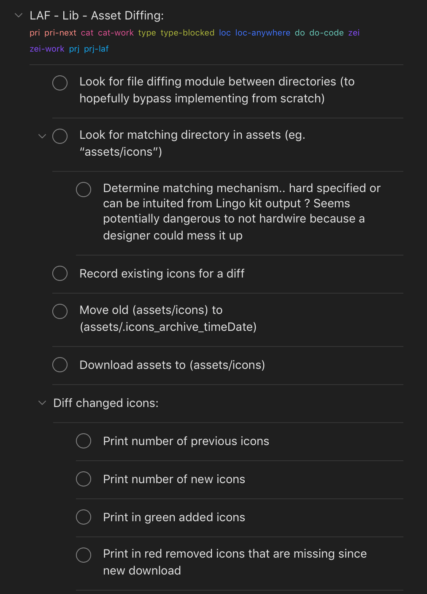

- What's the usual flow for getting graphics into an app folder?
- What are the potential shortcomings of that?
- What do I do differently?
- How could it be improved going forward?

Don't care about thoughts/want the goods? Jump to [References](#references)

---

## Riding the Squiggle

I was taught to “avoid automating what you don’t understand”. Here’s an ode to understanding the squiggle:

### Workflow

    1. Export assets from sketch
    2. Update the existing assets directory within the app repository:
       1. Overwrite the updated
       2. Remove the outdated
    3. Update file names
    4. Git
       1. Git status check
       2. Confirm that no critical assets are being removed
       3. Update repo

#### Potential Problems

##### Exporting manually: easy at first, cumbersome over time

Iterating on design constantly? I found that it was obnoxious to have to continually re-export for every little file change. Export. Download. Visually Diff. Add to correct folders. Re-run app. Confirm that image sources aren’t broken. Wait to do it again.

##### Downloading new files

Overwrite a file name and lose an asset as a result

##### Downloading old files with updated names

Forget to update an asset name in source and break an image

---

## Unwinding the Squiggle

### What am I working with here?

    - Sketch
    - Invision & Craft
    - Abstract

### What are the asset management options I explored?

- [Sketch](https://www.sketch.com/) with some plugins (eg. [artboard-manager](https://github.com/bomberstudios/artboard-manager))
- [Invision](https://www.invisionapp.com): Love their product. I'm an Invision fanboy. Unfortunately, their DSM fell short.
- [Zeplin](https://zeplin.io): Heard great things. Disappointed by experience. Felt like the "Inspect" feature of Invision wrapped in a native mac app.
- [Lingo](https://www.lingoapp.com/): Hmm… This looks interesting

#### The good of Lingo

- Sketch plugin makes it easy to fetch everything from my Sketch file into Lingo in one click

- Native desktop & web apps

- Developed by TheNounProject (ie. have established track record in the design community)
  https://thenounproject.com/
  https://github.com/TheNounProject

- API & JS SDK

#### The bad of Lingo (aka. the new squiggle)

Immediately after falling for Lingo, I discovered some emotional baggage: you cannot download all of the assets at once. At this point I was torn.

- Invision had an almost non-existent API experience for their DSM. But they did allow you to batch download all of your assets in a zip file

- Lingo had a great UX and a workable API. But I have to manually download 200+ assets ...? This would wipe out the time saved from the "pull all assets" feature their Sketch plugin offered.

---

## Straightening the Squiggle

### Brainstorming

Here’s the (initial) desired workflow I want:

    1. Fetch all new assets by pressing “pull assets” in Lingo (one button, no manual adding)
    2. Confirm the assets are still where they should be
    3. Download all files from lingo
    4. Sort them into proper sub-folders (~/MyRepo/assets/:lingo-section-name/:lingo-header-name)
    5. Archive the previous assets (ie. move them to a hidden directory be prepending a . )
    6. Print a log of all added and archived assets
    7. If the “—hard” flag was passed, automatically remove the archived directory
    8. If the “—soft” flag (or no flag) was passed, keep both the current and archived directory

### Fruits of the brainstorm

I’ve already implemented the first 3 steps [here](https://www.npmjs.com/package/laf)

#### Apples, Oranges, Bananas

Let's compare these three workflows:

    - vanilla Sketch
    - Sketch with Lingo
    - Sketch with Lingo & LAF

#### Storm of the fruits

Phases 4 - 8 are what I refer to as the “asset diffing” phase. I brainstormed some possible steps to implement that:

#### Benefits of this approach

- devs can be sure they’re always using the latest version of assets without worry of over/under-fetching
- lingo makes it easy to grab everything all at once (instead of needing to manually add)
- assets will always be downloaded to their relevant directory (ie. don’t have to download to finder & manually move files around)

#### Negatives of this approach

Seems fairly straight forward. But then it occurred to me that there are (at least) two downfalls to this implementation plan:

- designers can’t change the section/header names in Lingo willy-nilly.
- designers also can’t change the lingo tag names or Sketch layer names (the latter being a massive blocker IMO). Why? If they do, those files will be changed for the developer as well. This means that Lingo “tags” and Sketch “layers” become _extremely touchy_.
- renaming symbols requires manual renaming from dev (eg. you have “icon-arrow-left” and rename it to “icon-left-arrow” the dev will have to update on their end to match; will show in the file diff but doesn’t make the change for them)

Both of these issues stem from the fact that there’s a hardcoded link between lingo asset structure and app file structure.

#### Making Babel out of Lingonade

I realized that what I _really_ wanted was the ability to

    1. Design something in Sketch
    2. Store those assets in Lingo
    3. Fetch those assets from package.json as part of my build step
    4. Automatically update any symbolic references in my code

This _sounds_ nice but I realized that “asset diffing” was not enough. In order to unlock this final flow, I’m going to need to

    1. create a hash map of all assets’ names and their UUIDs
    2. store this locally in a keyval store like lowdb
    3. create a babel (or similar AST solution) plugin that will allow me to find/replace without accidentally wrecking code

If you’re interested in contributing, would love the help!
If you try out LAF in its current form, I would appreciate any feedback (GH issues work great)

---

## References

**CLI**

- `@github`: [lingo-asset-fetcher-cli](https://github.com/servexyz/lingo-asset-fetcher-cli)
- `@npm`: [laf](https://www.npmjs.com/package/laf)

**Lib**

- `@github`: [lingo-asset-fetcher-lib](https://github.com/servexyz/lingo-asset-fetcher-lib)
- `@npm`: [laf-lib](https://www.npmjs.com/package/laf-lib)

**Video Tutorials**

- 1/2: [laf gen](https://www.youtube.com/watch?v=J3UH4K_Nu0g)
- 2/2: [laf fetch](https://www.youtube.com/watch?v=J3UH4K_Nu0g)
