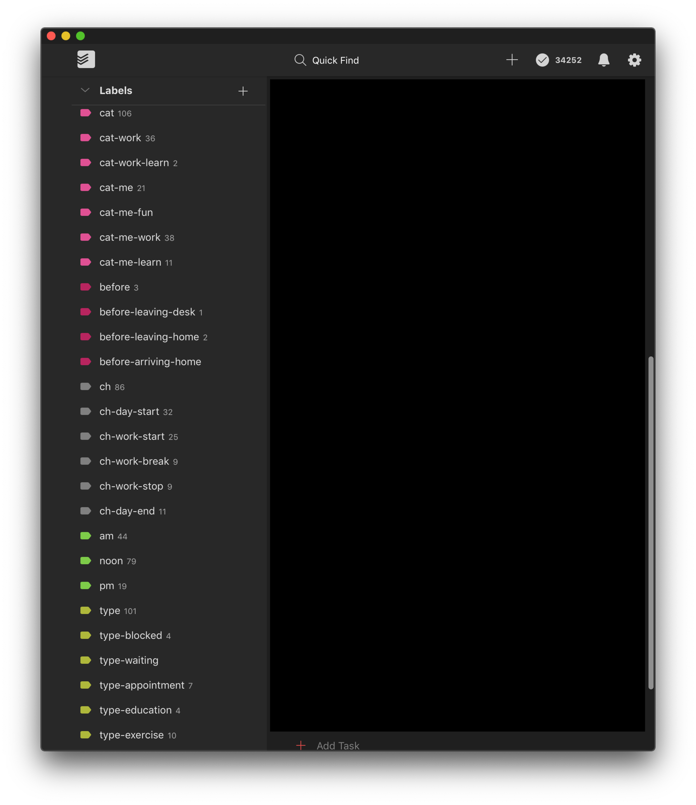
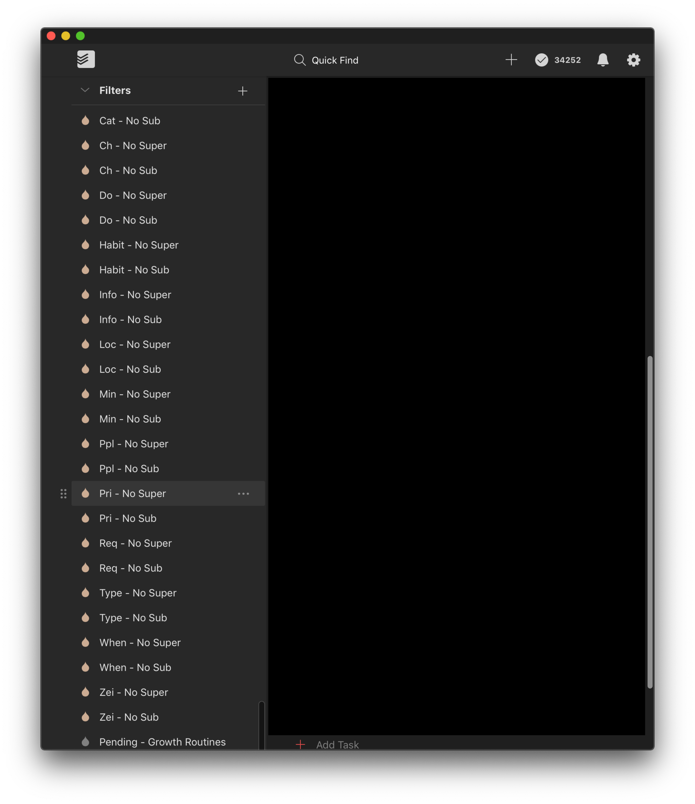

# Two Biggest Limitations of Labels & Filters in Todoist

## Pain Point

Sometimes I need to refer to a series of related labels in a filter. Let’s imagine that certain tasks you do have to be done in a certain location.

Basic Examples:

- you have to be at your `house` to bring in your mail
- you can’t pickup your kids from your `office`
- unless you have an app, you need to go to a `store` to buy grocieres

### Location label samples

To address these concerns, you create a few labels:

- `@house`
- `@office`
- `@store`

Let’s imagine you want to see any tasks which do _not_ have a location label specified. Here’s how that filter query would look:

### New Filter: `No Location Specified`

> Check for tasks without location specified

```
!(@house | @office | @store)
```

So far, so good. Personally, I have 13 location labels. But let’s imagine you kept it to these three examples. Every time you wanted to check whether you’ve added a location label to your tasks, you would have to check all three of these labels.

This is probably fine, but now let’s assume you want to create a new filter.

### New Filter: `Now - House - Work`

- “Now” is the _priority_
- “House” is the _location_
- “Work” is the _category_

You likely have multiple _priority_ and _category_ labels as well.

#### Priority labels

> Note: The `!!number` flag system seems like a remnant from agile which is ill-suited to general purposes project management given that Todoist uses it to influence the order in which tasks are rendered. The reason this ordering matters is that it directly impacts how tasks are grouped. Imagine that you have a “level 1” priority task that isn’t due until the evening. The entire day it’s highlighted in red at the top. There’s unnecessary cognitive cost here. You end up reading over the same lines multiple times even though you have no intention of using them.

- `@now`
- `@next`
- `@later`

#### Category labels

- `@work`
- `@chores`
- `@hobbies`

Now, your filter would look like this:

```
@now & @work & @house
```

Again, this isn’t so bad. But what happens when you want to see tasks which have been categorized but have not been prioritized? How about _Categorized_ with a _Location_ but not _Prioritized_?

### New Filter: `Categorized - Not Prioritized`

```
(@work | @chores | @hobbies) & !(@now | @next | @later)
```

### New Filter: `Categorized & Location - Not Prioritized`

```
(@work | @chores | @hobbies) & (@house | @office | @store) & !(@now | @next | @later)
```

Now imagine that you’re sitting there thinking, “you know `@home` is too general. This is _my home_. I’ll change `@home` to `@house`"!

Great. After you update those labels, you’ll notice that the labels update across every task. But wait, you’re not out of the woods yet ! You have to also update every.single.filter which relies on these labels.

---

## Temporary Workaround

You can create a superset label (which is what I do), like so:

- Superset label: `@type`
- Subset labels: `@type-blocked`, `@type-waiting`, etc.

**Label Examples**


Now thanks to `@type`, I can check a single label and determine whether those child-labels exist. This is incredibly useful in a number of places.

### Unfortunate Side Effects

The unfortunate side effect of this temporary workaround is: I have to create “reconciliation” filters (`Supetset Label - No Subset Label` or visa-versa).

**Reconciliation Filter Examples**


### Actual Reconciliation Filter: `Loc - No Super`

I’ve mentioned _location_ a few times. Here’s one of my reconciliation filters

```
!@loc & (@loc-desk | @loc-anywhere | @loc-home | @loc-office | @loc-rockharbor | @loc-store | @loc-javatinis | @loc-target | @loc-progeny | @loc-kcs-health | @loc-car | @loc-hangar18)
```

This is quite tedious, but these reconciliation filters are preferred to the alternative: not having a superset label which I can easily check.

Without the `@loc` label, I would have to check for the existence of _all_ of these labels in multiple filters. Thanks to `@loc` all of my filters can check for the existence - or lack - of location with `@loc` or `!@loc`.

---

## Ideal Workaround

Surely there has to be a better way, right?

Absolutely! All of this tedium could be solved easily by allowing **wildcards** in filters.

With wildcards there would be no need for superset labels or reconciliation filters whatsoever. For the sake of consistency, though, let’s look at that `Loc - No Super` reconciliation filter again with wildcards supported in Filters:

### Revisiting `Loc - No Super`

```
@loc & @loc-*
```

That’s it! Finito

---

## TLDR

- Support wildcards
- When renaming labels, update all instances of those labels in filters (just like all labels are already automatically updated across tasks)
